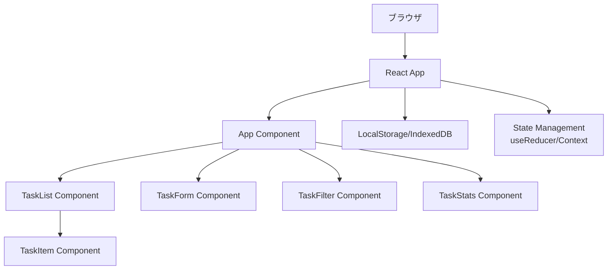

# TaskFlow - プロジェクト仕様書

## 📋 プロジェクト概要

### 目的
日々のタスク管理を効率化し、優先度とカテゴリーによる整理で生産性を向上させるWebアプリケーションを提供する。シンプルなUIで直感的に操作でき、データの永続化により継続的なタスク管理を実現する。

### 想定ユーザー
- 個人でタスク管理をしたいビジネスパーソン
- 学習計画を立てたい学生
- 日常のTODOを整理したい一般ユーザー
- シンプルで高機能なタスク管理ツールを求める人

### 期待される成果
- ブラウザで動作する高機能タスク管理アプリ
- 優先度とカテゴリーによる効率的なタスク整理
- データの永続化による継続的な利用
- モバイル対応のレスポンシブデザイン

## 🛠 技術スタック

### フロントエンド
- [x] React
- [x] TypeScript
- [x] Tailwind CSS
- [ ] Vue.js
- [ ] Next.js
- [x] その他: Vite (ビルドツール), React Icons

### バックエンド
- [ ] Node.js
- [ ] Python (FastAPI/Django)
- [ ] Go
- [x] その他: なし（フロントエンドのみ）

### データベース
- [ ] PostgreSQL
- [ ] MySQL
- [ ] MongoDB
- [x] その他: LocalStorage, IndexedDB (大量データ対応)

### インフラ
- [ ] AWS
- [ ] GCP
- [x] Vercel
- [ ] その他: 

## 📝 機能要件

### 必須機能
1. タスクの基本操作（CRUD）
   - タスクの作成（タイトル、説明、優先度、カテゴリー、期限）
   - タスクの編集
   - タスクの削除
   - タスクの完了/未完了切り替え

2. タスクの分類・整理
   - 優先度設定（高・中・低）
   - カテゴリー設定（仕事・個人・学習・その他）
   - 期限の設定と期限切れ警告

3. 表示・フィルタリング
   - カテゴリー別表示
   - 優先度別ソート
   - 完了/未完了フィルター
   - 期限順ソート

4. データ管理
   - LocalStorageへの自動保存
   - データのエクスポート（JSON形式）
   - データのインポート

### 追加機能（Nice to have）
1. タスクの検索機能
2. タスクの統計表示（完了率、カテゴリー別集計）
3. ダークモード対応
4. タスクのアーカイブ機能
5. 繰り返しタスクの設定

## 🔧 非機能要件

### パフォーマンス
- レスポンスタイム: 100ms以下
- 同時管理可能タスク数: 1000件以上
- スムーズなアニメーション（60fps）

### セキュリティ
- XSS対策（React標準機能）
- 入力値のバリデーション
- ローカルデータの暗号化（オプション）

### 可用性
- オフライン対応（LocalStorage/IndexedDB）
- モバイルフレンドリー（タッチ操作対応）
- ブラウザ互換性（Chrome, Firefox, Safari, Edge）

## 🏗 アーキテクチャ

### システム構成図


### ディレクトリ構造
```
taskflow/
├── src/
│   ├── components/
│   │   ├── TaskList/
│   │   │   ├── TaskList.tsx
│   │   │   └── TaskItem.tsx
│   │   ├── TaskForm/
│   │   │   └── TaskForm.tsx
│   │   ├── TaskFilter/
│   │   │   └── TaskFilter.tsx
│   │   ├── TaskStats/
│   │   │   └── TaskStats.tsx
│   │   └── common/
│   │       ├── Header.tsx
│   │       └── Footer.tsx
│   ├── hooks/
│   │   ├── useTasks.ts
│   │   ├── useLocalStorage.ts
│   │   └── useFilter.ts
│   ├── types/
│   │   └── task.ts
│   ├── utils/
│   │   ├── storage.ts
│   │   ├── export.ts
│   │   └── validation.ts
│   ├── context/
│   │   └── TaskContext.tsx
│   ├── App.tsx
│   ├── App.css
│   └── main.tsx
├── public/
├── index.html
├── package.json
├── tsconfig.json
├── vite.config.ts
├── tailwind.config.js
└── README.md
```

## 📅 開発ステップ

### Phase 1: 基盤構築
- [ ] #task プロジェクト初期設定
  - Vite + React + TypeScriptプロジェクト作成
  - Tailwind CSS設定
  - ESLint/Prettier設定
  - プロジェクト構造の作成
- [ ] #task 基本型定義とContext設定
  - Task型の定義
  - TaskContextの実装
  - カスタムフックの基本実装

### Phase 2: コア機能実装
- [ ] #task タスク管理機能
  - タスク作成フォームの実装
  - タスクリスト表示の実装
  - タスク編集機能の実装
  - タスク削除機能の実装
  - 完了/未完了切り替えの実装
- [ ] #task データ永続化
  - LocalStorage連携の実装
  - 自動保存機能の実装
  - データ復元機能の実装

### Phase 3: 高度な機能実装
- [ ] #task フィルタリング・ソート機能
  - カテゴリー別フィルター
  - 優先度別ソート
  - 期限順ソート
  - 完了/未完了フィルター
- [ ] #task エクスポート・インポート機能
  - JSONエクスポート実装
  - JSONインポート実装
  - バリデーション処理

### Phase 4: UI/UX改善
- [ ] #task UIデザイン実装
  - レスポンシブデザイン対応
  - アニメーション追加
  - アクセシビリティ対応
- [ ] #task 追加UI機能
  - 統計表示コンポーネント
  - 検索機能の実装
  - ダークモード対応

### Phase 5: テストとデプロイ
- [ ] #task テスト実装
  - ユニットテスト作成
  - 統合テスト作成
  - E2Eテスト作成
- [ ] #task デプロイ準備
  - ビルド最適化
  - 環境変数設定
  - Vercelへのデプロイ

## 📊 進捗管理

### マイルストーン
1. **M1**: 基盤構築完了 - 目標: 1日目
2. **M2**: コア機能完了 - 目標: 2日目
3. **M3**: 高度な機能完了 - 目標: 3日目
4. **M4**: UI/UX改善完了 - 目標: 4日目
5. **M5**: 本番リリース - 目標: 5日目

## 🔗 関連リンク

- GitHub Repository: https://github.com/yuni-shinogami/taskflow
- デモサイト: （デプロイ後に追加）
- デザインモック: ./design/
- 技術ドキュメント: ./docs/

## 📌 メモ・備考

- モバイルファーストで設計し、デスクトップでも快適に使えるようにする
- アクセシビリティを考慮し、キーボード操作にも対応
- 将来的にはPWA化も検討
- パフォーマンスを重視し、大量のタスクでも軽快に動作するよう最適化

---
*このドキュメントは随時更新されます*